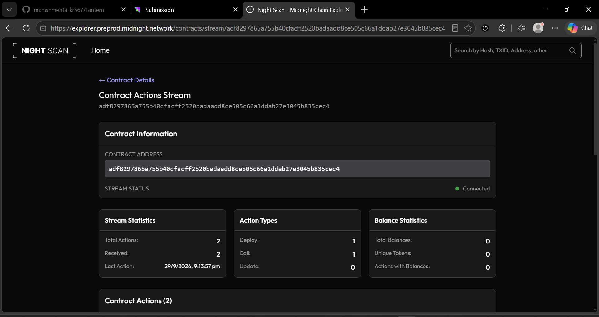

# Lantern
[](https://github.com/manishmehta-kr567/Lantern/actions/workflows/ci.yml)
> Anonymous incident reporting with verifiable participation. Built on Midnight.

### 🌟 Quick Links for Reviewers
- 📄 **[Read the full Product Proposal (PROPOSAL.md)](./PROPOSAL.md)**
- 🧪 **[View the Test Suite](./tests)**
- 🕵️ **[Read our Privacy Model & Claims](#privacy-model)**

## Live Demo
https://lantern-one-rho.vercel.app

## Demo Video
🎥 [Watch the 1-Minute Walkthrough Video (Google Drive)](https://drive.google.com/file/d/1OfQwS1P2SHpueNEeB_RY9WON5M0_JAaE/view?usp=sharing)

## Contract Address
| Network  | Address                          |
|----------|----------------------------------|
| Preprod  | `adf8297865a755b40cfacff2520badaadd8ce505c66a1ddab27e3045b835cec4` |

- 🔍 **Contract on Night Scan Explorer:** [View Preprod Contract](https://explorer.preprod.midnight.network/contracts/stream/adf8297865a755b40cfacff2520badaadd8ce505c66a1ddab27e3045b835cec4)
- ⚡ **Confirmed On-Chain Transaction:** [View Extrinsic on 1AM Explorer](https://explorer.1am.xyz/tx/9c784940d15e1aadae1e65f0b886eb671135f84da7c40358926b9cb22e9d6b87?network=preprod)




## What This Does
Lantern gives an organization a reporting channel where every report is provably from a verified member, yet cannot be traced to any individual.

An organization publishes the Merkle root of its eligible reporters. Members file a report by proving membership and choosing an incident category (Safety, Harassment, Fraud, Ethics, Other). The application generates a client-side zero-knowledge proof, pays network fees using Midnight DUST, balances the transaction with 1AM Wallet, and submits the proof on-chain to the Preprod network — leaving only a cryptographic nullifier and an incremented category counter. The text of a report never touches the chain in any form — not even as a hash.


## Privacy Model
- **PUBLIC:**
  - The channel's label and open/closed status
  - Per-category report counts (Safety, Harassment, Fraud, Ethics, Other)
  - Whether each report included written detail
  - The organization's eligible member Merkle root
  - The set of spent nullifier hashes (used to strictly prevent double-reporting)
- **PRIVATE:**
  - Who filed any report — the reporter's identity and secret key
  - The full text of every written report (stays on the local device only)
  - Any link between a nullifier and a specific reporter
- **PROVED without revealing:**
  - That the caller is a verified member of the organization (in the allowlist Merkle tree)
  - That this specific member has not already filed a report through this channel
  - All of the above without revealing who the member is or what they reported

## Privacy Claim
An on-chain observer can see how many reports exist in each category and confirm no member filed twice (the nullifier set only grows). What they cannot see, at any point, is who filed which report, or anything about report content. Known simplification: one report per reporter per channel — a production deployment would likely allow several, e.g. by adding a report-index to the nullifier.

## Tech Stack
- **Contract:** Compact (`preprod-deployment/contracts/src/bboard.compact`)
- **Frontend:** React + TypeScript + Vite + Tailwind CSS
- **Wallet:** Midnight DApp Connector API (1AM Wallet, multi-wallet detection)
- **ZK Proofs:** Generated client-side using the 1AM wallet's native proving provider
- **Tests:** Vitest, covering witness derivation, privacy, and state transition logic
- **CI/CD:** GitHub Actions (Node 22, Compact compile, full test suite)

## Prerequisites
- Node.js v22+, npm
- [Midnight `compact` CLI](https://docs.midnight.network)
- A Midnight-compatible wallet (1AM or Lace), funded on Preprod

## Setup & Run Locally
```bash
git clone https://github.com/manishmehta-kr567/Lantern.git
cd Lantern
npm install
npm run dev
```
The app requires a Midnight wallet extension and a deployed contract. See `deployed_contract.json` for the active Preprod contract address.

## Run Tests
```
npm test
```


## CI/CD
On every push and pull request to `main`, the GitHub Actions pipeline:
1. Checks out the code
2. Installs Node.js v22
3. Runs `npm install`
4. Installs the Compact toolchain and compiles the `.compact` contract
5. Builds the smart contract JS bindings
6. Runs the full Vitest test suite

## Product Proposal
See [PROPOSAL.md](./PROPOSAL.md).
